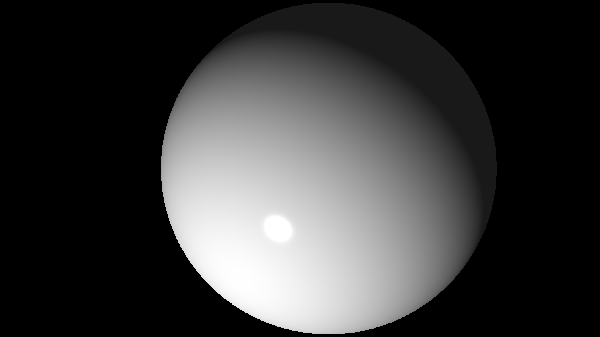
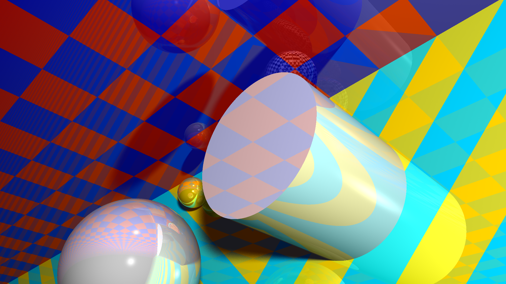
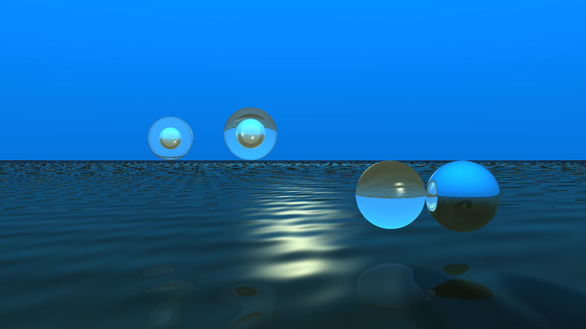
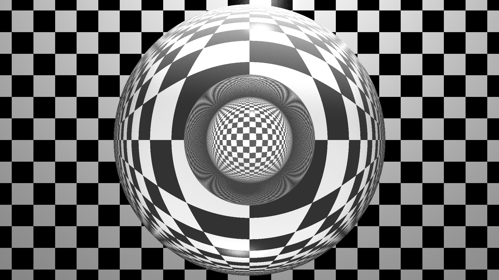
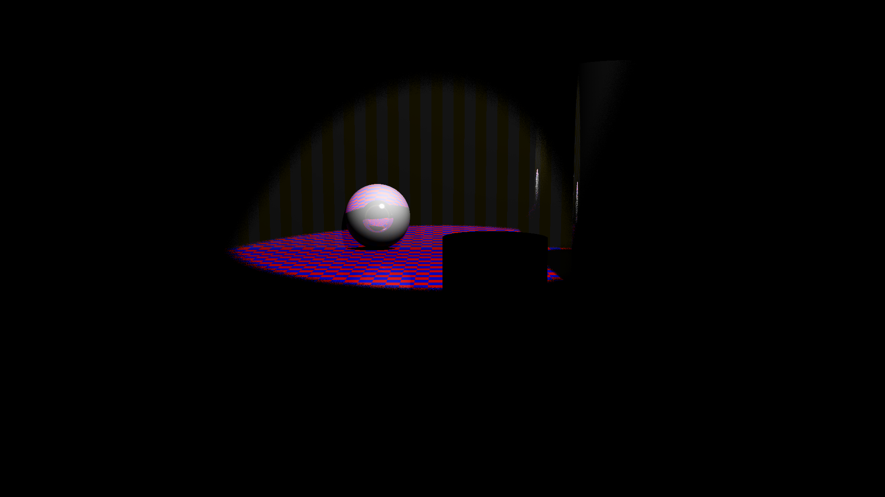

# miniRT

## Rendering Showcase

Single Sphere:

Complex Scene using soft shadows:

Ocean:

Refraction in Glas-Air:

Spotlight:

## Architecture & Rendering Pipeline

```mermaid
flowchart TD

subgraph group_lifecycle["Application Lifecycle"]
  node_main["Program Entry<br/>[main.c]"]
  node_startup["Application Startup<br/>[init.c]"]
  node_engine_init["Engine Initialization<br/>[init_engine.c]"]
  node_loop_render["Frame Loop<br/>[init.c]"]
end

subgraph group_scene["Scene Input"]
  node_parser["Scene Parser<br/>[parser.c]"]
  node_scene_handlers["Object Handlers<br/>[parse_object.c]"]
  node_demo_scenes["Demo Scenes<br/>[reflection_demo.c]"]
  node_world["World State"]
end

subgraph group_tracing["Ray Tracing"]
  node_renderer["Render Orchestrator<br/>[render.c]"]
  node_intersections["Ray Intersections<br/>[intersect.c]"]
  node_shading["Hit Shading<br/>[shade_hit.c]"]
end

subgraph group_effects["Surface Effects"]
  node_lighting["Phong Lighting<br/>[light.c]"]
  node_shadows["Soft Shadows<br/>[shadow.c]"]
  node_patterns["Surface Patterns<br/>[patterns.c]"]
  node_reflection["Reflection<br/>[reflect.c]"]
  node_refraction["Refraction<br/>[refraction.c]"]
end

subgraph group_output["Display and Storage"]
  node_mlx["MLX Window"]
  node_memory["Garbage Storage<br/>[gc_dyn_arr.c]"]
  node_canvas["Pixel Canvas<br/>[canvas.c]"]
  node_ppm["PPM Export<br/>[store_as_ppm.c]"]
end

node_user(("User"))
node_scene_file(("Scene File"))

node_user -->|"launches"| node_main
node_scene_file -->|"reads"| node_parser
node_main -->|"initializes"| node_startup
node_startup -->|"creates window"| node_mlx
node_startup -->|"starts engine"| node_engine_init
node_engine_init -->|"creates world"| node_world
node_engine_init -->|"creates canvas"| node_canvas
node_engine_init -->|"parses input"| node_parser
node_engine_init -->|"allocates arrays"| node_memory
node_parser -->|"dispatches objects"| node_scene_handlers
node_parser -->|"dispatches demos"| node_demo_scenes
node_scene_handlers -->|"adds objects"| node_world
node_demo_scenes -->|"builds presets"| node_world
node_startup -->|"installs loop"| node_loop_render
node_loop_render -->|"renders frame"| node_renderer
node_renderer -->|"casts rays"| node_intersections
node_renderer -->|"shades hits"| node_shading
node_shading -->|"computes light"| node_lighting
node_shading -->|"checks shadows"| node_shadows
node_shading -->|"samples patterns"| node_patterns
node_shading -->|"traces reflection"| node_reflection
node_shading -->|"traces refraction"| node_refraction
node_renderer -->|"writes pixels"| node_canvas
node_canvas -->|"displays pixels"| node_mlx
node_canvas -.->|"exports image"| node_ppm

click node_main "https://github.com/ilies1511/minirt_42/blob/main/srcs/main.c"
click node_startup "https://github.com/ilies1511/minirt_42/blob/main/srcs/init_exit/init.c"
click node_engine_init "https://github.com/ilies1511/minirt_42/blob/main/srcs/ft_engine/init_engine.c"
click node_parser "https://github.com/ilies1511/minirt_42/blob/main/srcs/parsing/parser_42/parser.c"
click node_scene_handlers "https://github.com/ilies1511/minirt_42/blob/main/srcs/parsing/parser_42/parse_object.c"
click node_demo_scenes "https://github.com/ilies1511/minirt_42/blob/main/srcs/demo_scenes/reflection_demo.c"
click node_world "https://github.com/ilies1511/minirt_42/blob/main/srcs/ft_engine/world/add_objs_to_world.c"
click node_memory "https://github.com/ilies1511/minirt_42/blob/main/srcs/garbage_collector/gc_dyn_arr.c"
click node_loop_render "https://github.com/ilies1511/minirt_42/blob/main/srcs/init_exit/init.c"
click node_renderer "https://github.com/ilies1511/minirt_42/blob/main/srcs/ft_engine/compute/render.c"
click node_intersections "https://github.com/ilies1511/minirt_42/blob/main/srcs/ft_engine/rays/intersect.c"
click node_shading "https://github.com/ilies1511/minirt_42/blob/main/srcs/ft_engine/compute/shade_hit.c"
click node_lighting "https://github.com/ilies1511/minirt_42/blob/main/srcs/ft_engine/light/light.c"
click node_shadows "https://github.com/ilies1511/minirt_42/blob/main/srcs/ft_engine/shadow/shadow.c"
click node_patterns "https://github.com/ilies1511/minirt_42/blob/main/srcs/ft_engine/patterns/patterns.c"
click node_reflection "https://github.com/ilies1511/minirt_42/blob/main/srcs/ft_engine/reflections/reflect.c"
click node_refraction "https://github.com/ilies1511/minirt_42/blob/main/srcs/ft_engine/refraction/refraction.c"
click node_canvas "https://github.com/ilies1511/minirt_42/blob/main/srcs/ft_engine/canvas/canvas.c"
click node_ppm "https://github.com/ilies1511/minirt_42/blob/main/srcs/parsing/ppm_parser/store_as_ppm.c"

classDef toneNeutral fill:#f8fafc,stroke:#334155,stroke-width:1.5px,color:#0f172a
classDef toneBlue fill:#dbeafe,stroke:#2563eb,stroke-width:1.5px,color:#172554
classDef toneAmber fill:#fef3c7,stroke:#d97706,stroke-width:1.5px,color:#78350f
classDef toneMint fill:#dcfce7,stroke:#16a34a,stroke-width:1.5px,color:#14532d
classDef toneRose fill:#ffe4e6,stroke:#e11d48,stroke-width:1.5px,color:#881337
classDef toneIndigo fill:#e0e7ff,stroke:#4f46e5,stroke-width:1.5px,color:#312e81
classDef toneTeal fill:#ccfbf1,stroke:#0f766e,stroke-width:1.5px,color:#134e4a
class node_main,node_startup,node_engine_init,node_loop_render,node_user toneBlue
class node_parser,node_scene_handlers,node_demo_scenes,node_world toneAmber
class node_renderer,node_intersections,node_shading toneMint
class node_lighting,node_shadows,node_patterns,node_reflection,node_refraction toneRose
class node_mlx,node_memory,node_canvas,node_ppm,node_scene_file toneIndigo
```
